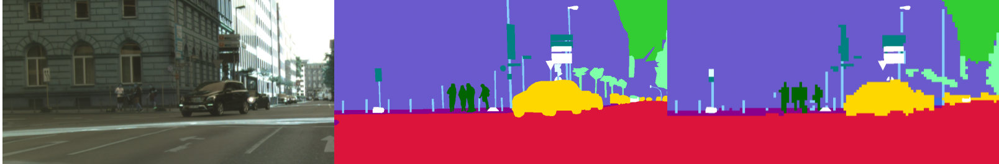

# Adaptive Pyramid Context Network for Semantic Segmentation


##Easy to Run

[AI Studio Link](https://aistudio.baidu.com/aistudio/projectdetail/2541370?contributionType=1&shared=1) @PaddlePaddle


| **ackbone**        | **Resnet101_v1c** |
| ------------------ | ----------------- |
| **Decode Head**    | **APCHead**       |
| **Auxiliary Head** | **FCNHead**       |


***

## Environment

```shell
#torch 1.8.0
conda install pytorch==1.8.0 torchvision==0.9.0 torchaudio==0.8.0 cudatoolkit=10.2 -c pytorch
pip install mmcv-full -f https://download.openmmlab.com/mmcv/dist/cu102/torch1.8.0/index.html
pip install prettytable
#paddle
python -m pip install paddlepaddle-gpu -i https://mirror.baidu.com/pypi/simple
```


## Pretrained model：

```yml
#mmcv resnet101_v1c  mmcv/model_zoo/open_mmlab.json:
"resnet101_v1c": "https://download.openmmlab.com/pretrain/third_party/resnet101_v1c-e67eebb6.pth"
```


## Weight tranpose：

###模型，日志,项目下载：

```shell
cd architectures
cp apcnetxxx_torch.pth architectures/pretrained/apcnetxxx_torch.pth
python torchModel2pdModel.py #generate apcnetxxx_paddle.pdparams
```
[Ai studio](https://aistudio.baidu.com/bdv3/user/303267/2541370/doc/tree/work/paddle_apcnet/experiments/apcnet-cityscapes)

[百度网盘](https://pan.baidu.com/s/1LVe__pSaNhcxxCQrLnQi8w)
提取码: ttqw 


## Dataset：

### Cityscapes:

gtFine 5000

1. Downdown to ./dataset

2. sh prepare.sh
3. cd cityscapesscripts/preparation
4. python createTrainIdLabelImgs.py


## Train:

Paddle:

```shell
sh paddle.sh
```


## Test:

Paddle:

```shell
python test.py
```


## Measure：

| Model               | mIou   |
| ------------------- | ------ |
| APCNet(paddle)     | 79.28% |


